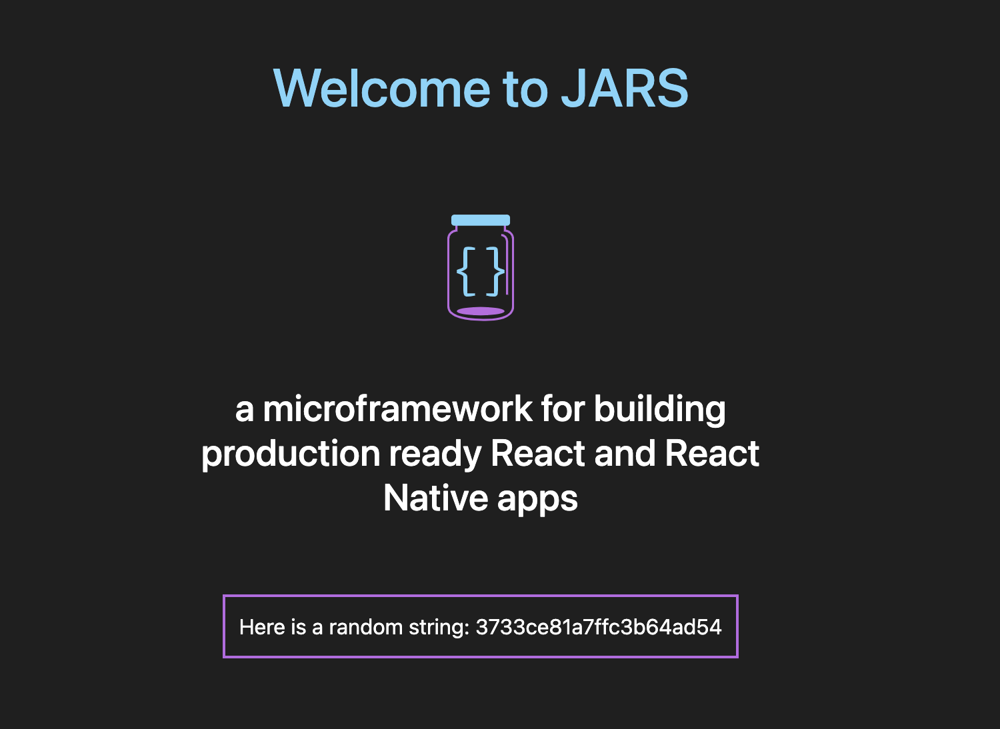

# Example: Create a Home Screen

Now that you have created a JARS project and glanced at the project structure, we can start getting our hands dirty. Our goal is to create a home screen called ```LandingPage.js``` which displays a ```Welcome to JARS``` message and fetches a random string from an API. 

<p align="center">
    
</p>